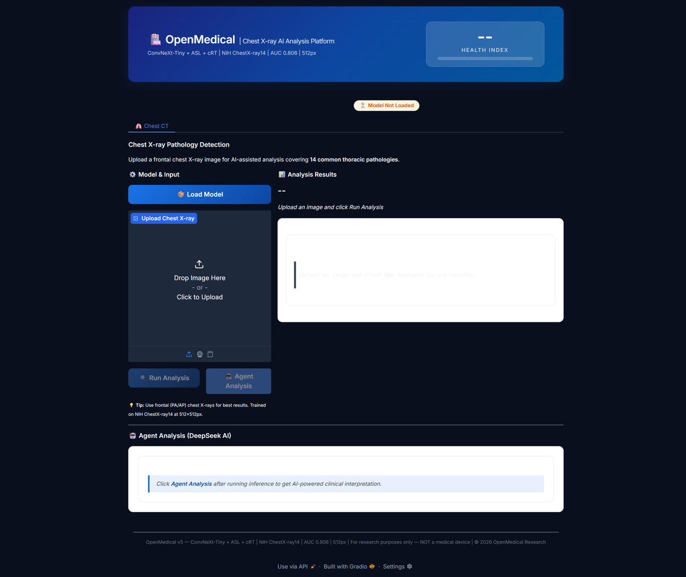
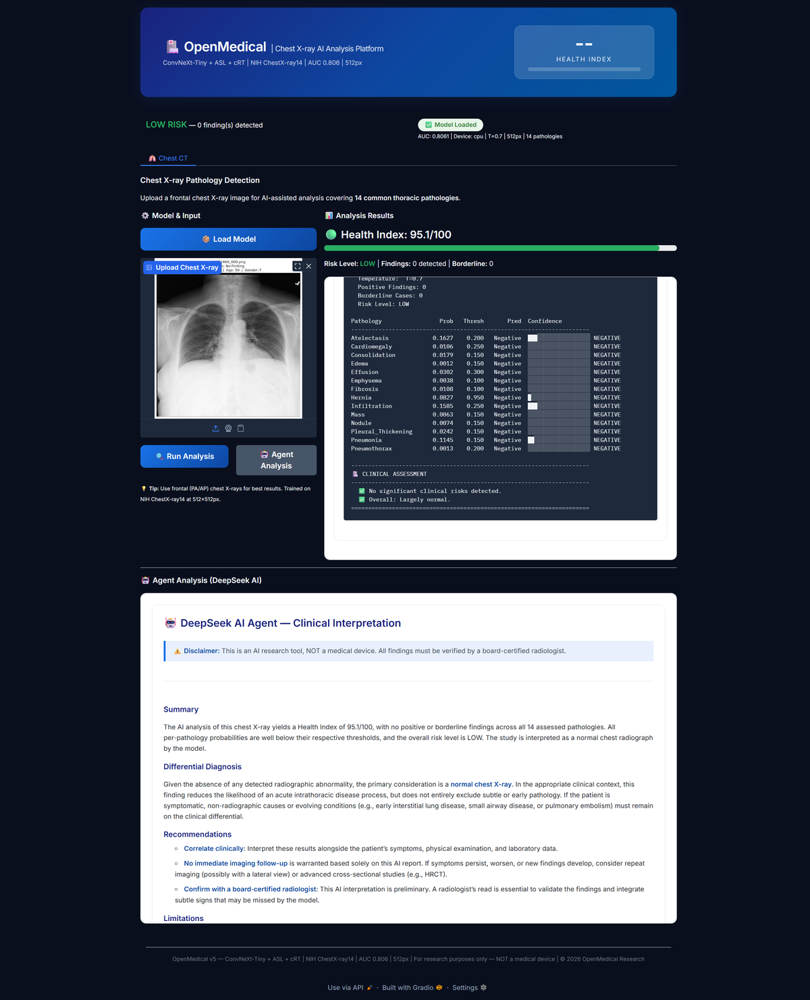
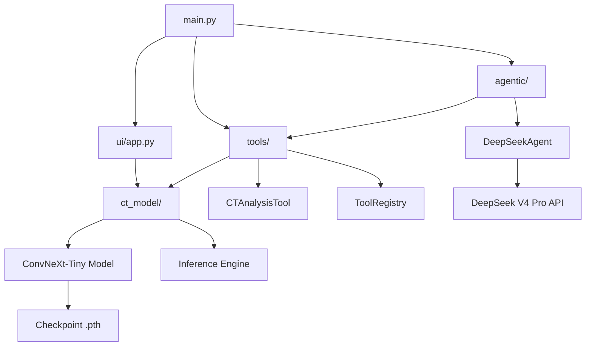

# 🏥 OpenMedical — The Start of New Medical Science

**Physical science × information science → the revolution of medical science.** Thermodynamics meets transformers. Molecular dynamics meets deep learning. Quantum chemistry meets agentic AI. OpenMedical converges these forces into tools that reshape how we understand, diagnose, and treat disease — open-source, at the bedside, for everyone.

[](https://www.python.org/)
[](https://pytorch.org/)
[](https://gradio.app/)
[](LICENSE)

---

## 📸 Screenshots

### Main Interface



### Analysis Results & Agent Interpretation



---

## 🧠 Overview

OpenMedical is an open-source platform that converges **physical science** and **information science** to revolutionize medical science itself. The physics of X-ray attenuation — Beer-Lambert law, Compton scattering, photoelectric absorption — is what forms the image on the detector. Statistical mechanics underpins the entropy losses and Boltzmann distributions that drive the learning. Quantum chemistry provides the molecular ontology of disease that the agent reasons over. Deep learning and agentic AI translate all of it into tools a clinician can use — right now, at the bedside, for free.

The old model — proprietary black-box systems locked behind seven-figure contracts — is ending. OpenMedical brings state-of-the-art medical AI to every researcher, every clinician, and every patient, free and open-source.

### 🫁 Chest X-ray — The First Domain

Chest radiography is the most common imaging exam on Earth, with over 2 billion studies performed annually. It is the ideal starting point: a high-impact, data-rich domain where AI can immediately augment clinical workflow. The inaugural OpenMedical module detects **14 thoracic pathologies** using a **ConvNeXt-Tiny** architecture trained on the NIH ChestX-ray14 dataset (112K images from 30,805 patients).

The platform integrates a **DeepSeek AI Agent** for clinical interpretation, providing differential diagnosis, recommendations, and confidence assessments.

| Metric | Value |
|--------|-------|
| **Architecture** | ConvNeXt-Tiny + ASL Loss + cRT |
| **Resolution** | 512x512 px |
| **Classes** | 14 pathologies |
| **Test AUC (macro)** | **0.806** |
| **F1 Macro** | 0.337 |
| **Training Data** | NIH ChestX-ray14 (86K images) |
| **Agent** | DeepSeek V4 Pro |

### Detected Pathologies

Atelectasis · Cardiomegaly · Consolidation · Edema · Effusion · Emphysema · Fibrosis · Hernia · Infiltration · Mass · Nodule · Pleural Thickening · Pneumonia · Pneumothorax

---

## 📁 Project Structure

```
OpenMedical/
├── main.py                          # Entry point: UI / --test / --agentic
├── requirements.txt                 # Python dependencies
│
├── ct_model/                        # CT Model Engine
│   ├── model.py                     #   ConvNeXt-Tiny architecture definition
│   └── inference.py                 #   Loading, transforms, inference, health index
│
├── tools/                           # Agent Tools
│   ├── ct_analysis_tool.py          #   CTAnalysisTool -- callable agent tool wrapper
│   └── tool_registry.py             #   ToolRegistry -- discover and invoke tools
│
├── agentic/                         # AI Agent (DeepSeek)
│   ├── .env                         #   API key configuration
│   └── deepseek_agent.py            #   DeepSeek V4 Pro API client + clinical interpreter
│
├── ui/                              # Web Interface (Gradio)
│   └── app.py                       #   Gradio UI with tabs, health index, controls
│
├── test_images/                     # Sample chest X-rays for testing
│   └── sample_xray.png
│
├── assets/                          # Screenshots & images
│
└── 20260718 CT Prediction/          # Training artifacts
    ├── checkpoints/
    │   ├── v5_stage1_latest.pth
    │   └── v5_stage2_latest.pth     # <-- Loaded for inference
    └── *.ipynb
```

---

## 🚀 Quick Start

### Prerequisites

- Python 3.10+
- PyTorch 2.0+ (with torchvision)
- DeepSeek API key (for agent analysis)

### Setup

```bash
# Clone the repository
cd OpenMedical

# Install dependencies
pip install -r requirements.txt

# Configure API key (optional, for agent analysis)
# Edit agentic/.env and set your key:
#   DEEPSEEK_API_KEY=sk-your-key-here
```

### Run

```bash
# Launch the web UI (http://127.0.0.1:7860)
python main.py

# Quick test: load model + run on sample image
python main.py --test

# Test agentic analysis (requires API key)
python main.py --agentic
```

### Usage Flow

1. Click **Load Model** to load the ConvNeXt-Tiny checkpoint
2. **Upload** a frontal chest X-ray image (PNG, JPG)
3. Click **Run Analysis** to get per-class probabilities and Health Index
4. Click **Agent Analysis** for AI-powered clinical interpretation

---

## 🏗️ Architecture



### Dependency Flow

| Layer | Consumes | Exposes |
|-------|----------|---------|
| `ct_model/` | PyTorch, torchvision, checkpoint | `ChestXrayInference` (singleton) |
| `tools/` | `ct_model/` | `CTAnalysisTool`, `ToolRegistry` |
| `agentic/` | `tools/`, DeepSeek API | `DeepSeekAgent` |
| `ui/` | `ct_model/`, `tools/`, `agentic/` | Gradio web interface |

---

## 📊 Health Index

The Health Index (0--100) is computed as the **harmonic mean** of per-class healthiness scores:

$$\text{Health Index} = 100 \times \frac{N}{\displaystyle\sum_{i=1}^{N}\frac{1}{\max(1-p_i,\ \varepsilon)}}$$

Where $N = 14$ pathology classes and $p_i$ is the predicted probability for class $i$.

The harmonic mean is sensitive to extreme values -- if any single pathology has a high probability, the index drops sharply, correctly reflecting clinical risk.

| Interpretation | Range |
|----------------|-------|
| Largely Normal | 85--100 |
| Some Findings | 60--84 |
| Significant Findings | 0--59 |

---

## 🔬 Model Details

### Architecture

- **Backbone**: ConvNeXt-Tiny (ImageNet pretrained)
- **Classifier Head**: Dropout, Linear(768 to 512), LayerNorm, GELU, Dropout, Linear(512 to 14)
- **Loss**: Asymmetric Loss (ASL) with gamma_neg=4, gamma_pos=0
- **Training**: Two-stage cRT (8 epochs full + 8 epochs classifier-only)
- **Sampling**: Square root sampling for class imbalance
- **Resolution**: 512 x 512 px
- **Temperature**: T=0.7 (calibrated via NLL minimization)
- **Thresholds**: Per-class optimal thresholds (0.10 to 0.95)

### Training Data

NIH ChestX-ray14 dataset: 112,120 frontal chest X-rays from 30,805 patients. 100% of training data used (86K images).

### Performance (v5 Industrial)

| Metric | Value |
|--------|-------|
| Test AUC (macro) | **0.806** |
| F1 Micro | 0.395 |
| F1 Macro | 0.337 |
| Emphysema F1 | 0.532 |
| Pneumothorax F1 | 0.491 |

---

## ⚠️ Disclaimer

**This is an AI research tool, NOT a medical device.** All findings and interpretations are for research and educational purposes only. Results must be verified by a board-certified radiologist before any clinical decision is made.

---

## 📄 License

MIT License -- see [LICENSE](LICENSE) for details.

---

## 🙏 Acknowledgments

- **NIH Clinical Center** for the ChestX-ray14 dataset
- **Sulake et al. (ISBI 2026)** for the ConvNeXt backbone approach
- **Hong et al. (2023)** for CXR-LT long-tail classification techniques
- **Ben-Baruch et al. (ICCV 2021)** for Asymmetric Loss (ASL)
